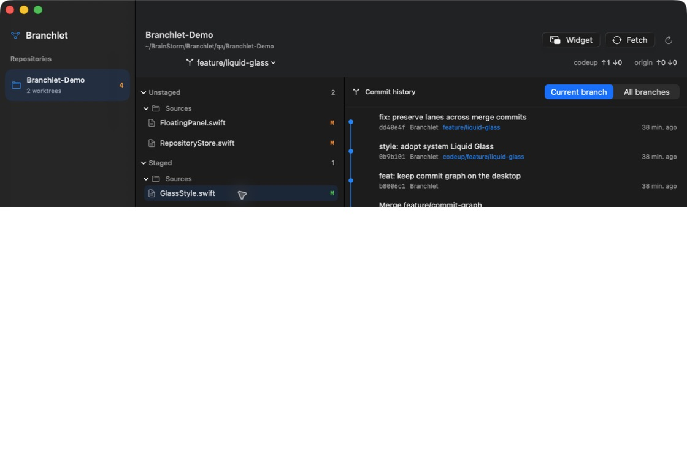
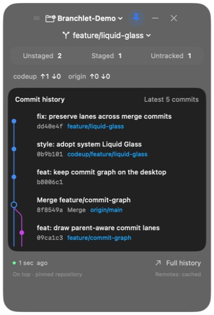
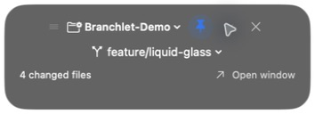

# Branchlet

**English** · [简体中文](README.zh-CN.md)

**Keep Git within reach.** A native macOS Git companion: a menu bar glance, a full repository inspector, and a floating commit graph that stays with you.

[](https://github.com/pj-workspace/Branchlet/actions/workflows/ci.yml)
[](LICENSE)

See what changed without opening your IDE. Pin a repository's commit graph above your work, switch worktrees independently, and open a native diff when you need the details. Built with **SwiftUI, AppKit, and system Liquid Glass** — no WebView or third-party dependencies.

## Native app screenshots

These screenshots show the running macOS app with a local demo repository. The changes, branches and commits come from real Git data.

### Repository inspector

Switch repositories on the left, inspect staged and unstaged files in the middle, and explore the commit graph and diffs on the right.



### A graph that stays with you

<table>
<tr><th>Floating commit graph</th><th>Collapsed view</th></tr>
<tr>
<td align="center"></td>
<td align="center"></td>
</tr>
</table>

The widget pins its own repository and worktree. Switching or closing the main window does not change what it monitors. Click a commit to open its details. Keep the widget on top, drag it, or collapse it; its position is remembered.

## Features

| Feature | Behavior |
| --- | --- |
| File status | Unstaged, staged, untracked and conflicted files. A file with both staged and unstaged edits appears in both groups. |
| Native diffs | Working tree vs. index, index vs. HEAD, new-file previews, and selectable text. |
| Commit graph | Parent-aware branching and merge lanes, including multiple parents, reference labels and short SHAs. |
| Graph scope | Current branch or all branches, showing up to the latest 160 commits. |
| Worktrees | Switch between existing worktrees without checking out or changing a branch on disk. |
| Multiple remotes | Independent ahead/behind counts for each remote, including GitHub and Codeup. |
| Floating widget | Its own repository/worktree selection, five recent commits, pinning, collapse and visibility across desktops. |
| Refresh | Active repository and widget about every 5 seconds; other added repositories about every 60 seconds. |
| Appearance | System light/dark appearance, native glass and system accessibility preferences for motion and transparency. |
| Languages | English and Simplified Chinese, following the macOS app language. |

**Remote status uses locally cached references.** Click **Fetch** in the inspector to retrieve remote updates. Branchlet does not automatically merge or push. A branch without a cached tracking reference is labeled **No tracking ref**, rather than being reported as up to date.

## Build and run

Requires **macOS 26+, Xcode 26+, Swift 6.2+**, and local Git.

```sh
git clone https://github.com/pj-workspace/Branchlet.git
cd Branchlet
swift test
./scripts/build-app.sh
open dist/Branchlet.app
```

Choose **Add repository** and select an existing local clone. Branchlet stays in the menu bar when you close the inspector.

The script builds for the current machine architecture and applies a local ad-hoc signature. The current development build is **not Developer ID signed or notarized**.

## Privacy and boundaries

- Repository analysis runs locally. There is no telemetry, hosted backend or Branchlet account.
- Preferences and repository paths are stored in `~/Library/Application Support/Branchlet/`.
- Remote access reuses your local Git configuration and authentication. Repository paths and Git commands are not sent to Branchlet's developers.
- Branchlet does not stage, commit, reset, delete branches, merge or push. Removing a repository only removes its entry from the app.
- Large diffs are capped at 512 KB and new-file previews at 256 KB, with a visible truncation notice. Binary contents are not rendered.
- This is **v0.1**. History is not paginated yet; PRs, Codeup approvals and CI status are not integrated.

## Development

```text
Sources/BranchletCore/   Git execution, structured parsers, parent-aware graph layout
Sources/Branchlet/       App state, AppKit windows, SwiftUI views, localization
Tests/                  Parser tests and real temporary Git repository integration tests
scripts/                App packaging and icon generation
```

Tests cover mixed staging state, filenames containing newlines, renames, conflicts, detached HEAD, multi-parent graphs, linked worktrees, merge diffs, all-branch history and independent remote counts. GitHub Actions runs tests and verifies the app bundle on macOS 26.

Issues and pull requests are welcome. For UI reports, include your macOS version and redact private code or credentials from screenshots.

## License

[MIT](LICENSE) © 2026 PAN JIE
