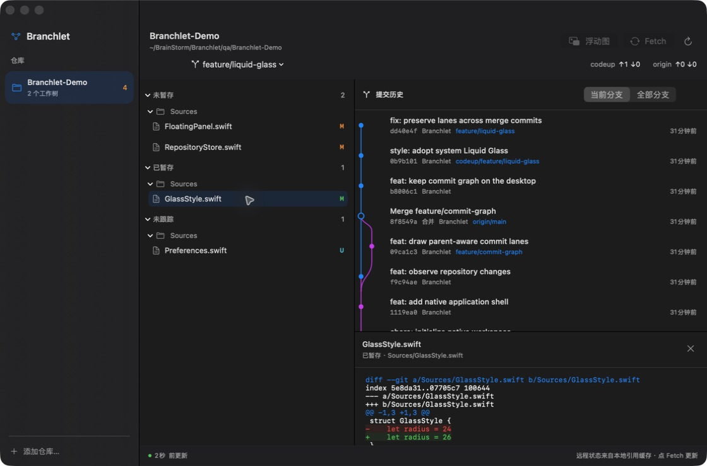
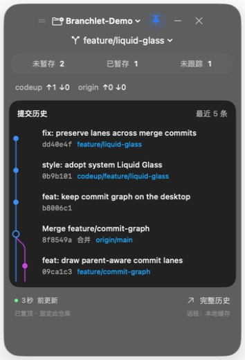

# Branchlet

[English](README.md) · **简体中文**

**把 Git 放在手边。**

A native macOS Git companion — a menu bar glance, a full repository inspector, and a floating commit graph that stays with you.

[](https://github.com/pj-workspace/Branchlet/actions/workflows/ci.yml)
[](LICENSE)

Branchlet 是一个原生 macOS Git 看板。无需一直打开 IDE：从菜单栏查看改动，把提交分支图固定在桌面，需要查看具体代码时展开完整窗口。界面采用 SwiftUI、AppKit 和系统 Liquid Glass，无 WebView、无第三方依赖。

## 实机预览

以下为原生应用截图，使用本地演示仓库；图片中的改动、分支和提交均由真实 Git 生成。

### 完整仓库窗口

左侧切换仓库，中间按暂存状态和目录查看文件，右侧查看提交分支图及逐行 Diff。



### 随时查看

<table>
<tr><th>常驻浮动分支图</th><th>收起后的状态</th></tr>
<tr>
<td align="center"></td>
<td align="center"></td>
</tr>
</table>

浮窗固定自己的仓库与工作树。切换或关闭主窗口不会改变浮窗的监控对象；点击提交直接进入完整详情。可置顶、拖动、收起，并记住位置。

## 当前能力

| 功能 | 行为 |
| --- | --- |
| 文件状态 | 未暂存、已暂存、未跟踪、冲突；同一文件的暂存与未暂存改动分别展示 |
| 文件 Diff | 工作区对暂存区、暂存区对 HEAD、新文件预览；支持复制文本 |
| 提交图 | 基于实际父提交关系绘制分叉、合并、多父节点；显示引用标签与短 SHA |
| 图范围 | 当前分支 / 全部分支，每次最多显示最近 160 条提交 |
| 多工作树 | 切换已有 worktree；不执行 checkout，不改变磁盘上的分支 |
| 多远程 | 分别比较各 remote 的 ahead / behind，适用于 GitHub、Codeup 等 Git 服务 |
| 常驻浮窗 | 独立仓库与工作树、最近 5 条提交图、置顶、跨桌面显示、收起 |
| 自动刷新 | 当前仓库及浮窗约每 5 秒刷新；其他已添加仓库约每 60 秒刷新 |
| 外观 | 系统深浅色、原生玻璃材质，遵循减少动态效果与降低透明度设置 |
| 语言 | 英文与简体中文，跟随 macOS 应用语言 |

**远程状态是本地引用缓存。** 点击完整窗口中的 **Fetch** 获取远程最新状态；不会自动合并或推送。首次使用或新建分支未配置跟踪引用时，界面显示“无跟踪分支”，不会把未知状态标为已同步。

## 从源码运行

环境：**macOS 26+、Xcode 26+、Swift 6.2+**，需要本机 Git。

```sh
git clone https://github.com/pj-workspace/Branchlet.git
cd Branchlet
swift test
./scripts/build-app.sh
open dist/Branchlet.app
```

首次打开后选择 **添加仓库**，指向已经克隆的本地 Git 目录。菜单栏会常驻 Branchlet 图标；关闭完整窗口不会退出应用。

构建脚本生成当前机器架构的 `.app` 并进行本地 ad-hoc 签名。当前版本尚未进行 Developer ID 签名或 Apple 公证。

## 数据与边界

- 所有仓库分析在本机运行。没有遥测、云端后台或账号系统。
- 仓库路径、窗口选择等设置保存在 `~/Library/Application Support/Branchlet/`。
- 复用本机 Git 的远程配置和凭证方式。仓库状态与 Git 命令参数不发送给 Branchlet 的开发者。
- 不执行暂存、提交、重置、删除分支、合并或推送。列表中的“移除”只移除应用内记录。
- 大型 Diff 截断在 512 KB，新文件预览截断在 256 KB，并明确提示；不渲染二进制文件内容。
- 当前是 **v0.1 开发版**：提交历史暂不分页，不包含 PR、Codeup 审批或 CI 状态集成。

## 开发

```text
Sources/BranchletCore/   Git 执行、结构化解析、父节点分支图布局
Sources/Branchlet/       应用状态、AppKit 窗口、SwiftUI 界面
Tests/                  解析测试和真实临时 Git 仓库集成测试
scripts/                .app 打包与图标生成
```

测试覆盖混合暂存状态、含换行的文件名与重命名、冲突、分离 HEAD、多父提交图、worktree、合并 Diff、全部分支范围及双远程独立计数。CI 在 GitHub 的 macOS 26 runner 上执行测试并验证应用签名。

欢迎通过 [Issues](https://github.com/pj-workspace/Branchlet/issues) 反馈问题或提交 PR。报告界面问题时，请注明 macOS 版本，并隐藏截图中的私有代码与凭证。

## License

[MIT](LICENSE) © 2026 PAN JIE
